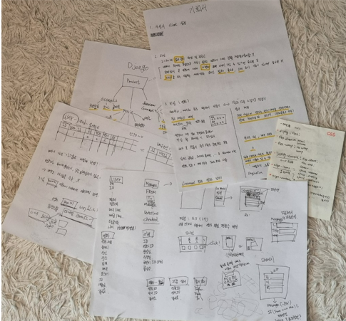
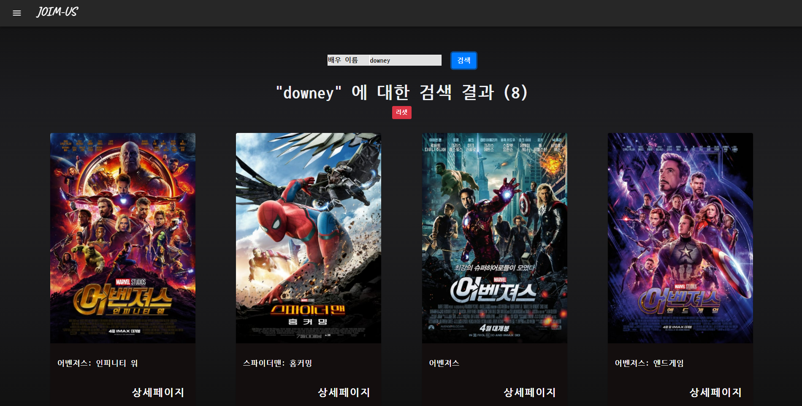
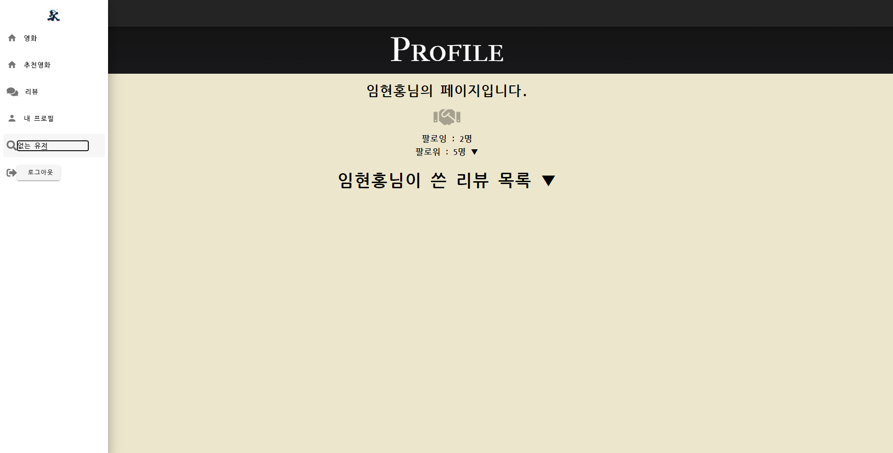
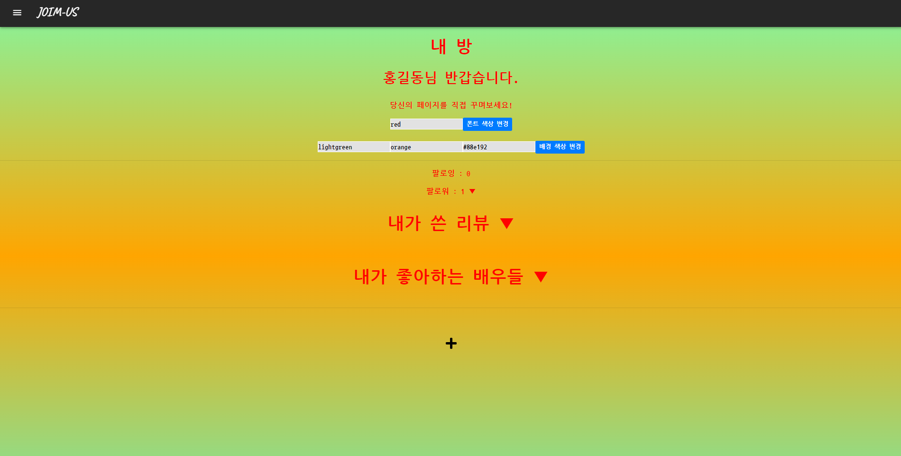

# FINAL - PROJECT


# 팀 소개

## 															*Team	:	JOIM-US*

|  CREW  | ROLE            |      Design       |        Django        |         Vue          | DataBase | CSS, Art |
| :----: | --------------- | :---------------: | :------------------: | :------------------: | :------: | :------: |
| 임현홍 | Project Manager | 의견 제시 및 컨펌 |  movies, community   |  movies, community   |          |  Leader  |
| 조영현 | Project Leader  | 의견 제시 및 컨펌 | accounts, additional | accounts, additional |  Leader  |          |


# 명세

### 1. 목표

-  영화 정보 기반 추천 서비스 구성

- 커뮤니티 서비스 구성 

- HTML, CSS, JavaScript, Vue.js, Django, REST API, DataBase 등을 활용한 실제 서비스 설계

- 서비스 관리 및 유지보수

  

### 2. 개발환경

#### 	A. 언어 

​		i. 	    Python 3.8+ 

​	    ii. 	   Django 3.X

​	    iii.  	 Node LTS

​		iv.  	 Vue.js 2.+

#### 	B. 도구 

​		i. 	  vsCode

​		ii. 	 Chrome Browser 

#### 	C. 아키텍쳐

​		i. 	  Django & Vanila JS

​		ii. 	 Django REST API 서버 & Vue.js


### 3. 서비스 개요

#### 	A. 본 프로젝트는 '영화'를 주제로 진행되기 때문에, 영화 정보 데이터베이스를 필수적으로 가지고 있어야 합니다.

​		i. 	  데이터를 수집하는 방법은 제한없이 자유롭게 진행합니다.

​		ii. 	 영화 데이터 수집 예시는 다음과 같습니다.

​			1. 	 영화 진흥 위원회

​			2. 	 네이버 검색 API(영화) 

​			3. 	 The Movie Database(TMDB)

​		iii. 	최초에 각 팀 별로 등록된 영화 레코드(record)는 최소 50개 이상을 유지해야 합니다.


#### 	B. 모바일 대응을 위한 반응형 웹, Django REST API 서버 및 프론트엔드 프레임워크(Vue.js) 분리 등의 상세 구현 방식은 자유		 롭게 구성하되, 프로젝트 README.md 상단에 프로젝트 구조에 대한 설명을 반드시 명시해야 합니다.


#### 	C. 영화 커뮤니티에 필요한 기능을 구성하여야 합니다.


#### 	D. 사용자에게 제공되는 영화 추천 방식은 자유롭게 구성하되 해당 서비스를 이용하는 사용자는 반드시 영화를 추천 받을 수 있		 어야 합니다.


#### 	E. 최소한의 HTML/CSS를 통해 웹 사이트를 디자인 해야합니다.


### 4. 요구사항 

​	아래의 세부 요구사항은 필수 기능으로 프로젝트 내에 반드시 포함되어야 합니다. 

​	이 외의 추가적인 기능 및 디자인 등은 팀 별로 자유롭게 수행할 수 있습니다.


#### 	A. 관리자 뷰

​		i. 	  관리자 권한의 유저만 영화 등록 / 수정 / 삭제 권한을 가집니다.

​		ii. 	 관리자 권한의 유저만 유저 관리 권한을 가집니다.

​		iii. 	장고에서 기본적으로 제공하는 admin 기능을 이용하여 구현합니다.

​		iv. 	 Vue.js를 활용하는 경우에도 Django admin기능을 이용하여 구현할 수 있습니다.


#### 	B. 영화 정보

​		i. 	   Vue.js를 활용하는 경우에도 Django admin기능을 이용하여 구현할 수 있습니다.

​		ii. 	  모든 로그인 된 유저는 영화에 대한 평점 등록 / 수정 / 삭제 등을 할 수 있어야 합니다.

​	

#### 	C. 추천 알고리즘

​		i. 	   평점을 등록한 유저는 해당 정보를 기반으로 영화를 추천 받을 수 있어야 합 니다.

​		ii. 	  추천 알고리즘의 지정된 형식은 없으나, 사용자는 반드시 최소 1개 이상의 방식으로 영화를 추천 받을 수 있어야 합니다.

​		iii. 	 추천 방식은 각 팀별로 자유롭게 선택할 수 있으며 어떠한 방식으로 추천 시스템을 구성 했는지 설명할 수 있어야 합니다.


#### 	D. 커뮤니티

​		i. 	   영화 정보와 관련된 대화를 할 수 있는 커뮤니티 기능을 구현해야 합니다.

​		ii. 	  로그인한 사용자만 글을 조회 / 생성 할 수 있으며 작성자 본인만 글을 수정 / 삭제 할 수 있습니다.

​		iii. 	 사용자는 작성된 게시글에 댓글을 작성할 수 있어야 하며 작성자 본인만 댓글을 삭제 할 수 있습니다.

​		iv. 	 사용자는 작성된 게시글에 댓글을 작성할 수 있어야 하며 작성자 본인만 댓글을 삭제 할 수 있습니다.


#### 	E. 기타

​		i. 	   최소한 5개 이상의 URL 및 페이지를 구성해야 합니다.

​		ii. 	  HTTP Method와 상태 코드는 상황에 맞게 적절하게 반환되어야 하며, 필요에 따라 메시지 프레임워크 등을 사용하여 에러 페이지를 구성해야 합니다.

​		iii. 	 필요한 경우 Ajax를 활용한 비동기 요청을 통해 사용자 경험을 적절하게 향상 시켜야 합니다.


# 프로젝트 기획 단계




# 목표 서비스 구현 및 실제 구현 정도

```txt
명세에서 요구한 기능들은 모두 구현 완료
- 세부 설명
0. 리뷰 작성은 영화를 감상한 이후에 작성한다는 가정하에, 영화 상세 페이지에서만 해당 영화에 대한 리뷰를 작성할 수 있도록 함.
	0-1. 리뷰 별점테러를 막기 위해, 해당 영화에 남긴 리뷰가 있는 사람이 다시 그 영화에 리뷰를 남기지 못하게 함.
	0-2. 리뷰 수정 버튼을 누르면 기존의 내용을 모두 담은 채로 리뷰 수정을 진행하도록 함.
	0-3. 실수로 리뷰를 삭제하는 일을 방지하기 위해 삭제 버튼 클릭시 확인창을 띄움


+ 추가로 구현한 기능

0. 로그인 시에 칸 영화제 마크를 잠시 노출시킨 이후 추천페이지로 이동시킴.

1. 내 프로필, 다른 유저의 프로필 페이지를 구현하여 해당 유저를 팔로우하거나 쓴 게시글을 확인할 수 있음.

	1-1. 내 프로필에서 내가 좋아요 표시한 배우들 목록을 확인가능하며, 내 프로필 내의 목록에서 좋아요/좋아요 취소가 가능함.
	1-2. 내 프로필에서 기분에따라 폰트와 배경색상을 변경시킬 수 있음.
	1-3. 팔로워 / 리뷰 / 좋아요 목록(내 프로필 에서만 제공)은 토글 형식으로 펼치기 / 접기가 가능함.

2. nav-bar에서 username을 검색하여 해당 유저의 프로필 페이지로 이동가능, 사용자가 본인의 이름을 검색하면 MyProfile로 이동함.

3. 전체 영화 목록 페이지에서 영화 제목 / 출연한 배우 이름으로 해당하는 영화들만 검색해서 보는 것이 가능함.

4. 영화 상세 페이지에서 출연한 배우들 중, 인지도가 일정 수준 이상인 배우들만 추려서 출력하고, 해당 배우를 좋아요 할 수 있음.

5. 내가 좋아요 / 좋아요 취소한 배우들의 목록은 실시간으로 데이터베이스에 반영되며 이에 따라 추천 영화 알고리즘 역시 실시간으로 반영되어 새로운 결과를 	  보여줌.

	5-1. 좋아요 표시한 배우가 없거나, 희망하는 사람들에 한해 전체 영화 배우들을 가시성이 좋도록 나누어 띄워주는 페이지 제공.

```


# 데이터베이스 모델링(ERD)


# 필수 기능에 대한 설명

```markdown
- 영화 추천 알고리즘
모든 영화의 id를 이용하여 TMDB에서 출연 배우를 검색, 인지도가 10점 이상인 배우들만 추려서 영화배우 테이블에 추가함.
영화배우를 추가하면서 해당 영화가 가지고있는 장르들을 배우에게 추가시켜주고, 배우는 출연한 영화가 많아질수록 각 장르에 대한 점수가 높아짐.
이후에 사용자가 해당 배우를 좋아요 표시하게 되면 Trigger에 의해 user역시 해당 배우가 가지고있는 장르들의 점수를 획득하게 되고,
최종적으로 가장 선호하는 장르들을 추릴 수 있게 된다. 따라서 해당 장르를 가지고있는 영화들을 추려서 그 중 최대 10개의 영화들을 추천해주는 방식이다.

ex) 
어벤져스1(장르 : 모험, 액션, SF)
루카(장르 : 애니메이션 코미디 판타지 가족)
보스 베이비 2(장르 : 모험 애니메이션 코미디 가족)
여기서, 어벤져스1에 A라는 배우가 출연했다면 A라는 배우의 장르점수에 모험,액션,SF가 1점 추가되고,
B라는 배우가 루카와 보스베이비2에 출연했다면 B의 애니메이션, 코미디, 가족 2점 모험,판타지에 1점이 추가되는 식이다.
이러한 방식으로 점수를 누적시킨 배우들을 좋아요 목록에 추가한 사용자의 니즈에 맞는 추천목록을 보여주게 되는데,
만약 좋아요 표시를 하나도 하지 않은 유저가 있다면, 좋아요를 표시하기 쉽도록 모든 배우들의 목록이 나타나는 페이지로 유도하도록 했다.
```


# 프로젝트 시작에 앞서...


#### client / 프로젝트 생성 및 기본적인 작업 이후 추가작업을 위해 설치한 것들

```bash
$ npm install vuetify
$ npm install @splidejs/vue-splide
$ npm install --save vue-moment
```


#### server / 프로젝트 생성 및 기본적인 작업 이후 추가작업을 위해 설치한 것들

```python
beautifulsoup4==4.10.0
bs4==0.0.1
sqlparse==0.4.1
# 모두 requirements.txt에 추가되어있다.
```


# 결과

## 로그인 페이지


## 로그인 이후 추천 영화 목록 페이지로 이동


```markdown
로그인 이후 추천 영화 목록 페이지로 이동 하기 전에,
칸 영화제 로고를 잠시동안 보여주면서 사용자들의 기대감을 상승시키고,
칸 영화제에 온 것 같은 느낌을 주기 위해 넣어둔 페이지.
```


## 추천 영화 목록으로 이동


```markdown
방금 회원가입 했거나, 아직 어떤 배우에게도 좋아요 표시를 하지 않은 유저는 추천 알고리즘의 혜택을 받을 수 없다.
```


## 갑시다! 버튼을 눌러 배우 목록들을 띄워주는 화면


```markdown
사용자의 선호 장르/배우를 파악하기 위해 배우들의 사진과 이름을 함께 나열하여 선택하기 쉽게끔 만들어 둔 페이지.
첫 페이지에서는 이전 페이지로 가는 버튼이 없다.
```


## 배우 좋아요를 진행중인 모습


```markdown
끝날때까지 계속해서 진행할 수도 있고, 사용자가 이만하면 됐다 싶을 때 언제든 그만하기 버튼을 눌러 해당 페이지를 빠져나갈 수 있다.
```


## 그만두기 버튼을 눌렀을 경우


```markdown
만약 실수로 그만두기 버튼을 눌렀다면, 더하기 버튼을 눌러 계속 진행할 수도 있다.
여기서도 끝내기 버튼을 누르면 영화 추천 페이지로 이동한다.
보통 빨간 버튼은 부정적이거나 그만두는 버튼인 이미지가 강하기 때문에 빨간 색으로 배치했다.
```


## 알고리즘에 의한 영화 추천 페이지


```markdown
사용자가 선택한 영화배우들이 주로 출연한 영화들의 장르를 파악하여, 가장 빈도가 높게 나온 두 가지 장르의 영화들을 추천한다.
가장 위 Carousel은 영화 장르 추천에 상관없이, 서비스 제공자가 노출시키고 싶은 영화 목록들을 나타내준다.
```


## 추천 영화들이 계속해서 회전하는 모습


```markdown
대부분의 OTT들과는 다르게, 추천 영화 목록들이 자연스럽게 회전하면서 사용자가 스크롤 할 필요 없이 가만히 있다가 흥미가 생기는 영화를 발견하게 되면 클릭할 수 있게끔 설계하였다.
```


## 전체 영화 목록 페이지


```markdown
만약, 추천영화중에 원하는 영화가 없거나, 전체 영화 목록 중에서 무언가를 찾고싶은 것이 있을 경우를 위해 만들어 둔 페이지.
영화 제목이나 출연한 배우의 이름으로 검색이 가능하다.
```


## 검색창을 활용한 모습



```markdown
배우의 이름으로 검색을 하면 해당 배우가 출연한 영화들이 나열된다.
각 영화의 포스터에 마우스를 올려두면 약간 확대되며 기본적인 줄거리들을 볼 수 있다.
```


## 영화 상세 정보 페이지


```markdown
영화 상세 정보 페이지로 들어가게 되면 가장 먼저 영화의 포스터를 크게 볼 수 있으며, 줄거리 전체를 읽을 수 있다.
```


## 영화 상세 정보 페이지 하단


```markdown
하단으로 스크롤을 조금 내려보면, 해당 영화에 대한 리뷰를 작성할 수 있는 버튼과
해당 영화에 출연한 영화 배우들이 나열된다.
이미 사용자가 좋아요 한 배우들의 경우 체크박스가 체크된 상태로 보여지며, 여기서 체크하거나 체크상태를 푸는 것으로
사용자의 좋아요 목록이 데이터베이스에 실시간 반영된다. 이것은 추천 영화 페이지 목록에도 영향을 준다.
```


## 영화를 보고 나서, 다른 사람들과 이야기를 하기 위해 나온 모습


```markdown
어두운 영화관에서 집중하여 영화에 대해 관람하였다면,
이제 밝은 곳으로 나와서 사람들과 재밌게 본 영화에 대해 이야기 할 수 있는 공간이 마련되어있다.
Croisette는 칸 영화제가 열리면 세계 각국의 영화 관계자들이 모여서 영화에 대한 이야기를 나누는 장소로 유명한데,
여기서 따온 이름을 사용했다.
```


## 리뷰 디테일 페이지


```markdown
각 사용자들이 적어둔 리뷰에 대한 상세정보들을 볼 수 있는 페이지.
게시글을 작성한 본인이 해당 페이지에 접근하게 되면 수정/삭제 버튼이 나타나며 좋아요를 표시할 수 있고,
수정 버튼을 누를 시 이 리뷰의 정보들이 담긴 페이지로 이동하게 되고 삭제 버튼을 누를 시 삭제 확인창이 나타난다.
좋아요 누른 사람들 목록을 토글상태로 확인할 수 있다.
누구나 댓글을 달 수 있으며 마찬가지로 본인이 단 댓글이라면 삭제 버튼이 나타나게된다.
```


## Nav-bar 에서 다른 유저를 검색한 모습



```markdown
Nav-bar에서 다른 유저의 ID를 검색하게 되면 해당 유저의 프로필 페이지가 나타난다.
배경색상은 편안하고 따뜻한 스위트룸의 느낌을 주기 위해 아이보리 계열의 색상으로 선택했다.
해당 유저를 팔로우 할 수 있으며, 그 유저가 쓴 리뷰의 목록 역시 토글 형식으로 확인할 수 있다.
```


## Nav-bar 에서 없는 유저를 검색한 모습


```markdown
Nav-bar에서 없는 유저를 검색하게 되면 빈 프로필 페이지를 보여주는 것이 아니라 해당 유저는 없음을 확인시켜주는 창과
정확한 ID를 입력하지 않았음을 알려주는 Alert 창이 나타난다.
```


## 내 프로필 또는 유저 검색창에 본인의 아이디를 검색한 경우


```markdown
Nav-bar에서 내 프로필을 클릭하거나 유저 검색창에 본인의 아이디를 검색한 경우 바로 내 프로필 페이지로 이동하게 된다.
이곳도 다른 사용자의 Profile 페이지처럼 밝고 정적인 색상을 줄 수 있었으나, 타인에게 보여지는 점잖은 모습이 아니라
자신만의 공간을 자신만의 개성으로 채울 수 있도록 폰트와 배경색상을 바꿀 수 있는 선택지를 주었다.
다른 사용자의 페이지와 같이 팔로워/리뷰 목록을 확인할 수 있고,
개인이 선호하는 배우는 프라이버시이기 때문에 내 프로필 에서만 확인할 수 있다.
하단의 + 버튼을 누르면 선호도 체크를 위한 배우목록 페이지로 이동할 수 있다.
```


## 기분에 따라 내 페이지를 바꾼 모습



```markdown
당신의 공간입니다. 마음껏 꾸며보세요!
```


## 내가 좋아하는 배우들의 모습을 보기위해 클릭으로 토글한 모습


```markdown
내가 좋아하는 배우들의 목록이 나열된다.
여기서 체크를 풀게 되면 내 좋아요 배우 목록에 즉각적으로 반영되고, 실수로 체크해제 했거나 마음이 바뀐 경우를 대비하여
해당 목록을 바로 갱신하는 것이 아니라 사용자가 다시 체크할 수 있게끔 빈 칸으로 둔다.
```


## 내가 쓴 리뷰와 팔로워 목록을 열어본 모습


```markdown
토글 형식이며, 펼치게 되면 아래로 향하던 세모가 위로 향하는 세모로 바뀌어
사용자에게 다시 누르면 접을 수 있을 거라는 생각이 들게끔 유도했다.
```


# 후기

긴 기간 고생한 만큼 많은 것들을 배웠고 그만큼 재미있는 경험이었다.
# MovieApp
